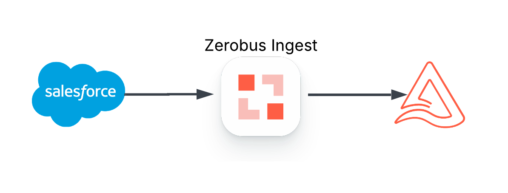

# salesforce-zerobus

Stream Salesforce Change Data Capture (CDC) events into Databricks Delta tables in near
real-time via the Salesforce Pub/Sub API and the Databricks Zerobus API.

This repository ships **two independent implementations** of the connector:

| Directory | Implementation | Use it when |
|-----------|----------------|-------------|
| **[`python/`](python/)** | Python library + Databricks Asset Bundle (single org per instance). | You want the simplest drop-in service for one Salesforce org, or the Spark Data Source. |
| **[`go_salesforce_zerobus/`](go_salesforce_zerobus/)** | Long-term, multi-tenant pure-Go service. | You need to ingest many Salesforce orgs from one deployment. |

Each directory is self-contained with its own README, dependencies, and Databricks bundle:

- **Python** — see **[python/README.md](python/README.md)**. Run commands from `python/`
  (`cd python`): `uv sync`, `python main.py`, `pytest`, and `databricks bundle deploy`.
- **Go** — see **[go_salesforce_zerobus/README.md](go_salesforce_zerobus/README.md)**.

> `(depr) go_salesforce_zerobus_cgo/` is a deprecated single-tenant Go port, kept for reference only.

## License

[MIT](LICENSE.md)
