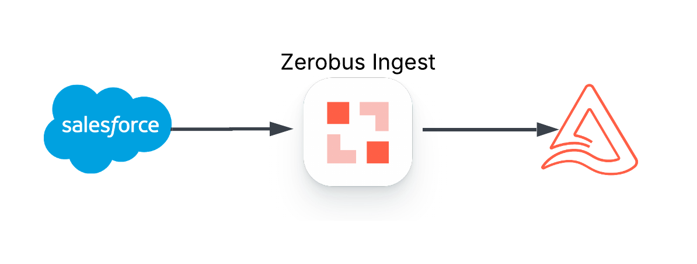

# SalesforceZerobus 🚀



A simple, production-ready Python library for streaming Salesforce Change Data Capture (CDC) events to Databricks Delta tables in real-time using the Salesforce Pub/Sub API and Databricks Zerobus API.

[](https://www.python.org)


[](https://opensource.org/licenses/MIT)

## Reach out to your Databricks account team for private preview access to Databricks Zerobus!

## Features

- **🚀 Simple API** - Single class interface with just 4 required parameters
- **⚡ Real-time Streaming** - Sub-second event forwarding to Databricks 
- **⛔️ Eliminates Message Buses** - With Databricks Zerobus you know longer need message buses to sink data to your lake.  
- **🔄 Zero Data Loss** - Automatic replay recovery ensures no missed events during outages
- **🛡️ Production Ready** - Comprehensive error handling, health monitoring, and timeout protection
- **🔐 OAuth Security** - Uses Service Principal authentication for enhanced security (API tokens deprecated)
- **📦 Self-contained** - Bundles all dependencies (no external wheel dependencies)
- **🔧 Flexible Configuration** - Support for all Salesforce objects (Account, Lead, Contact, Custom Objects)
- **⚙️ Both Sync & Async** - Use blocking calls or async context manager patterns
- **📊 Built-in Logging** - Detailed event processing logs for monitoring
- **🧱 Databricks Asset Bundle** - Provided Databricks Asset Bundle to get you up and running in minutes

## 🚀 Local Quick Start
### Installation

**Prerequisites:**
1. Obtain the `databricks_zerobus-X.X.X-py3-none-any.whl` file from your Databricks account team
2. Place the .whl file in the project root directory

**Install dependencies:**
```bash
uv add databricks_zerobus-*.whl
uv sync
```

### Minimal Working Example

```python
#!/usr/bin/env python3
import logging
from salesforce_zerobus import SalesforceZerobus

# Configure logging to see event processing
logging.basicConfig(
    level=logging.INFO,
    format='%(asctime)s - %(name)s - %(levelname)s - %(message)s'
)

# Initialize the streamer
streamer = SalesforceZerobus(
    # What Salesforce CDC channel to monitor  
    sf_object_channel="ChangeEvents",
    
    # Where to send the data in Databricks
    databricks_table="your_catalog.your_schema.all_change_events", # If the table doesn't exist the service will create the table for you.
    
    # Salesforce credentials
    salesforce_auth={
        "username": "your@email.com",
        "password": "yourpassword+securitytoken",  # Password + security token (no spaces)
        "instance_url": "https://your-instance.salesforce.com"
    },
    
    # Databricks credentials (OAuth Service Principal)
    databricks_auth={
        "workspace_url": "https://your-workspace.cloud.databricks.com",
        "client_id": "your-service-principal-client-id",
        "client_secret": "your-service-principal-client-secret",
        "ingest_endpoint": "12345.zerobus.region.cloud.databricks.com"
    }
)


print("Starting Salesforce to Databricks streaming...")
print(
    f"Monitoring Channel:AccountChangeEvent → Databricks Table:AccountchangeEvents"
)

if __name__ == "__main__":
    streamer.start()
```

### Expected Log Output

When running, you'll see logs like this:

```bash
2025-08-26 08:20:12 - salesforce_zerobus.core.Account - INFO - Authenticating with Salesforce...
2025-08-26 08:20:13 - salesforce_zerobus.core.Account - INFO - Authentication successful!
2025-08-26 08:20:13 - salesforce_zerobus.core.Account - INFO - Resuming from previous session with replay_id: 00000000000408760000
2025-08-26 08:20:13 - salesforce_zerobus.core.Account - INFO - Starting subscription to /data/AccountChangeEvent
2025-08-26 08:20:13 - salesforce_zerobus.core.Account - INFO - Batch size: 10, Mode: CUSTOM
2025-08-26 08:20:15 - salesforce_zerobus.core.Account - INFO - Received Account UPDATE 001abc123def456
2025-08-26 08:20:15 - databricks_forwarder - INFO - Written to Databricks: your_catalog.your_schema.account_events - Account UPDATE 001abc123def456
```

### Async Usage

```python
import asyncio
import logging
from salesforce_zerobus import SalesforceZerobus

async def main():
    logging.basicConfig(level=logging.INFO)
    
    streamer = SalesforceZerobus(
        sf_object_channel="LeadChangeEvent",
        databricks_table="catalog.schema.lead_events",
        salesforce_auth={...},
        databricks_auth={...}
    )
    
    # Use async context manager
    async with streamer:
        print("🚀 Async streaming started...")
        await streamer.stream_forever()

# Run the async streamer
asyncio.run(main())
```

## 🌐 Multi-Object Streaming with ChangeEvents

### Stream All Salesforce Objects at Once

Instead of subscribing to individual object channels like `AccountChangeEvent` or `LeadChangeEvent`, you can subscribe to **all change events** across your entire Salesforce org using the `ChangeEvents` channel:

```python
from salesforce_zerobus import SalesforceZerobus

streamer = SalesforceZerobus(
    # Subscribe to ALL object changes in your Salesforce org
    sf_object_channel="ChangeEvents",

    databricks_table="catalog.schema.all_salesforce_events",
    salesforce_auth={...},
    databricks_auth={...}
)

streamer.start()
```

### Key Benefits

- **🎯 Single Stream**: Capture Account, Contact, Lead, Opportunity, Custom Objects, etc. in one subscription
- **🚀 Automatic Schema Handling**: Library automatically manages different schemas for each object type
- **📊 Unified Table**: All events go to one Delta table with `entity_name` identifying the object type
- **⚡ Efficient Caching**: Schemas are cached per object type for optimal performance

### Understanding Multi-Object Data

With `ChangeEvents`, each event includes an `entity_name` field identifying the object:

```bash
INFO - Received Account UPDATE 001abc123def456
INFO - Received Contact CREATE 003xyz789ghi012
INFO - Received CustomObject__c DELETE 001def456abc789
```

### When to Use ChangeEvents vs Specific Objects

**Use `ChangeEvents` when:**
- You need a comprehensive view of all Salesforce activity
- Building data lake ingestion for entire org
- Creating audit trails or compliance monitoring
- Prototyping or exploring data patterns

**Use specific objects (e.g., `AccountChangeEvent`) when:**
- You only care about specific object types
- Building targeted integrations
- Need to minimize data volume and processing
- Want separate tables per object type

## ⚡ Spark Structured Streaming Data Source

### Bidirectional Streaming with Salesforce

In addition to the Databricks Zerobus integration, this project includes a **Spark Data Source** for bidirectional streaming with Salesforce Platform Events and Change Data Capture (CDC).

### Key Capabilities

**📖 Reader (Subscription)**
- Real-time streaming from Salesforce Platform Events and CDC
- Automatic bitmap field decoding for change events
- Configurable replay with exactly-once processing
- Automatic schema management with Avro decoding

**✍️ Writer (Publishing)**
- Publish streaming data to Salesforce Platform Events
- Event forwarding between Salesforce topics with transformations
- Custom data publishing from any Spark streaming source
- Batch optimization for high-volume scenarios

### Quick Example

```python
from spark_datasource import register_data_source
from pyspark.sql.functions import col, current_timestamp

# Register the data source
register_data_source(spark)

# Read from Salesforce
df = spark.readStream.format("salesforce_pubsub") \
    .option("username", USERNAME) \
    .option("password", PASSWORD) \
    .option("topic", "/data/AccountChangeEvent") \
    .option("replayPreset", "EARLIEST") \
    .load()

# Stream to Delta table
df.writeStream \
    .format("delta") \
    .option("checkpointLocation", "/path/to/checkpoints/") \
    .toTable("catalog.schema.salesforce_events")

# Write back to Salesforce
your_stream.writeStream \
    .format("salesforce_pubsub") \
    .option("username", USERNAME) \
    .option("password", PASSWORD) \
    .option("topic", "/data/CustomEvent__e") \
    .start()
```

### When to Use Spark Data Source vs. Zerobus Library

**Use Spark Data Source when:**
- You need bidirectional streaming (read AND write to Salesforce)
- Working with existing Spark Structured Streaming pipelines
- Require complex transformations using Spark SQL/DataFrame APIs
- Need to integrate with other Spark data sources

**Use Zerobus Library when:**
- You need simple, one-way streaming to Databricks Delta tables
- Want minimal configuration and setup
- Prefer lightweight Python applications
- Need automatic table creation and replay recovery

📖 **[View Full Spark Data Source Documentation →](spark_datasource/README.md)**

## 📋 Prerequisites & Local Setup

### 1. Salesforce Setup

#### Enable Change Data Capture
1. **Log into Salesforce** → **Setup** → **Integrations** → **Change Data Capture**
2. **Select objects** to monitor (Account, Lead, Contact, etc.)
3. **Click Save** and wait 2-3 minutes for topics to become available

#### Get Security Token
1. **Setup** → **My Personal Information** → **Reset My Security Token**
2. **Check your email** for the security token
3. **Append to password**: `yourpassword` + `SECURITYTOKEN` (no spaces)

#### Verify API Access
- Ensure your user profile has **API Enabled** permission
- Check that your org allows Pub/Sub API access

### 2. Databricks Setup

#### Create OAuth Service Principal
1. **Go to your Databricks workspace**
2. **Navigate to Settings → Identity and Access → Service Principals**
3. **Create a new Service Principal**
4. **Generate OAuth credentials**:
   - Generate and save the **client ID** and **client secret**
   - These replace traditional API tokens for better security
5. **Grant permissions** to your Service Principal:
   - Table access permissions for your target Delta table
   - Workspace permissions for SQL operations

#### 🔐 OAuth vs API Tokens (Migration Guide)

**For users migrating from API tokens:**
- **Enhanced Security**: OAuth tokens auto-refresh every hour vs. static API tokens
- **Unified Authentication**: Single Service Principal for all Databricks operations
- **Simplified Configuration**: No separate SQL API tokens needed
- **Future-Proof**: Databricks recommends OAuth for 2025+ (API tokens being deprecated)

**Migration steps:**
1. Create Service Principal (steps above)
2. Update environment variables:
   ```bash
   # Replace these:
   # DATABRICKS_API_TOKEN=dapi...
   # DATABRICKS_SQL_API_TOKEN=dapi...

   # With these:
   DATABRICKS_CLIENT_ID=your-service-principal-client-id
   DATABRICKS_CLIENT_SECRET=your-service-principal-client-secret
   ```
3. Update ingest endpoint format:
   ```bash
   # Change from: workspace-id.ingest.region.cloud.databricks.com
   # To:         workspace-id.zerobus.region.cloud.databricks.com
   ```

#### 🚨 Table Configuration
If you do not create the table before running the service, a table will be made for you using the name specified in main.py. This step is optional.

🚨 **Important**: `'delta.enableRowTracking' = 'false'` must be set for all Zerobus target tables.
#### (Optional) Create Delta Table
Run this SQL in your Databricks workspace:

```sql
CREATE TABLE IF NOT EXISTS your_catalog.your_schema.account_events (
  event_id STRING COMMENT 'Unique Salesforce event identifier',
  schema_id STRING COMMENT 'Event schema version from Salesforce',
  replay_id STRING COMMENT 'Event position for replay functionality', 
  timestamp BIGINT COMMENT 'Event timestamp in milliseconds',
  change_type STRING COMMENT 'Type of change: CREATE, UPDATE, DELETE, UNDELETE',
  entity_name STRING COMMENT 'Salesforce object name (Account, Contact, etc.)',
  change_origin STRING COMMENT 'Source of the change (API, UI, etc.)',
  record_ids ARRAY<STRING> COMMENT 'List of affected Salesforce record IDs',
  changed_fields ARRAY<STRING> COMMENT 'List of field names that were modified',
  nulled_fields ARRAY<STRING> COMMENT 'List of field names that were set to null',
  diff_fields ARRAY<STRING> COMMENT 'List of field names with differences',
  record_data_json STRING COMMENT 'Complete record data serialized as JSON',
  payload_binary BINARY COMMENT 'Raw Avro binary payload for schema-based parsing',
  schema_json STRING COMMENT 'Avro schema JSON string for parsing binary payload',
  org_id STRING COMMENT 'Salesforce organization ID',
  processed_timestamp BIGINT COMMENT 'When this event was processed by our pipeline'
)
USING DELTA
TBLPROPERTIES (
  'delta.enableRowTracking' = 'false',
  'delta.autoOptimize.optimizeWrite' = 'true',
  'delta.autoOptimize.autoCompact' = 'true',
)
COMMENT 'Real-time Salesforce Change Data Capture events';
```

#### Get Databricks Credentials
- **API Token**: User Settings → Developer → Access tokens → Generate New Token
- **Workspace URL**: Your Databricks workspace URL (e.g., `https://workspace.cloud.databricks.com`)
- **Ingest Endpoint**: Found in workspace settings (format: `workspace-id.ingest.cloud.databricks.com`)

## ⚙️ Configuration Options

### Complete Configuration Example

```python
streamer = SalesforceZerobus(
    # Required parameters
    sf_object_channel="AccountChangeEvent", # Salesforce CDC channel (AccountChangeEvent, CustomObject__cChangeEvent, or ChangeEvents)
    databricks_table="catalog.schema.table",   # Target Databricks table
    salesforce_auth={                      # Salesforce credentials dict
        "username": "user@company.com",
        "password": "password+token", 
        "instance_url": "https://company.salesforce.com"
    },
    databricks_auth={                      # Databricks OAuth Service Principal
        "workspace_url": "https://workspace.cloud.databricks.com",
        "client_id": "your-service-principal-client-id",
        "client_secret": "your-service-principal-client-secret",
        "ingest_endpoint": "workspace-id.zerobus.region.cloud.databricks.com"
    },
    
    # Optional parameters with defaults
    batch_size=10,                         # Events per fetch request (default: 10)
    enable_replay_recovery=True,           # Zero-loss recovery (default: True)
    auto_create_table=True,                # Auto-create Databricks table if missing (default: True)
    backfill_historical=True,              # Start from EARLIEST for new tables (default: True)
    timeout_seconds=300.0,                 # Semaphore timeout (default: 300s)
    max_timeouts=3,                        # Max consecutive timeouts (default: 3)
    grpc_host="api.pubsub.salesforce.com", # Salesforce gRPC host
    grpc_port=7443,                        # Salesforce gRPC port  
    api_version="57.0"                     # Salesforce API version
)
```
## 🧱 Run as Databricks App
Running this service as a Databricks app and subscribing to ChangeEvents is a great way to stream all Salesforce changes with low costs, simplified ci/cd, and a rich governance model. 
View the databricks.yml to see the .whl being built. 
1. View the contents of resources/app.yml
2. Configure the app.yaml file variables
3. Deploy the Databricks Asset Bundle: 
    1. Comment out the job/pipeline .yml contents if you do not wish to deploy a job or pipeline 
    2. terminal: ```databricks bundle deploy -t dev ```
    3. terminal: ```databricks sync --full . /Workspace/Users/{user}/.bundle/{bundle_name}/dev/files```
4. View the app in the databricks UI. Deploy the app. 
5. Deploy the Lakeflow Declarative Pipeline resource to flatten and parse the streamed data

## 🧱 Run as Databricks Job
### Running the service as a Databricks Job
Running this service as a Databricks job leverages the For/Each task type to ingest several Salesforce Objects in parallel. 

Running the following commands in the terminal will deploy a serverless job, the packaged .whl file, and the notebook_task.py. To view the contents being built view databricks.yml

1. In the notebook_task.py file edit the variables salesforce_auth, databricks_auth, secret_scope_name before deploying the job
2. Run the following commands: 
    ```bash
    brew tap databricks/tap
    brew install databricks
    databricks bundle deploy -t dev 
    ```
3. To edit the objects being ingested, extend the list at the bottom of the databricks.yml


### Supported Salesforce Objects

Works with any Salesforce object that has Change Data Capture enabled:
#### Read Every Object Change
- `ChangeEvents`

#### Standard Objects ExampleL
- `Account`, `Contact`, `Lead`, `Opportunity`, `Case`

#### Custom Objects
- Any custom object with CDC enabled (e.g., `CustomObject__c`)

## 🏗️ Automatic Table Creation & Historical Backfill

### Smart Table Management

The library automatically handles Databricks table creation and historical data backfill:

**New Deployment (Table Doesn't Exist)**:
- ✅ **Auto-creates** Delta table with optimized CDC schema
- 🕰️ **Historical Backfill**: Starts from `EARLIEST` to capture all historical events
- 📊 **Optimized Schema**: Includes partitioning and auto-compaction

**Existing Deployment (Table Exists)**:
- 🔄 **Resume**: Continues from last processed `replay_id` using zero-loss recovery
- ⚡ **Fast Startup**: Uses cached replay position for immediate streaming

**Empty Table (Created but No Data)**:
- 🕰️ **Backfill Mode**: Starts from `EARLIEST` to capture historical events
- 📈 **Progressive Load**: Processes events chronologically from the beginning

### Configuration Options

```python
streamer = SalesforceZerobus(
    # Auto-creation behavior  
    auto_create_table=True,     # Create table if missing (default: True)
    backfill_historical=True,   # Start from EARLIEST for new/empty tables (default: True)
    
    # Alternative configurations
    auto_create_table=False,    # Require table to exist, fail if missing
    backfill_historical=False,  # Start from LATEST even for new tables (real-time only)
)
```

### Example Scenarios

**Scenario 1: Fresh Deployment**
```bash
INFO - Table catalog.schema.account_events doesn't exist - creating and configuring for historical backfill
INFO - Successfully created table: catalog.schema.account_events  
INFO - Starting historical backfill from EARLIEST (this may take time for large orgs)
```

**Scenario 2: Service Restart**
```bash
INFO - Found latest replay_id: 00000000000408760000
INFO - Resuming from replay_id: 00000000000408760000
```

**Scenario 3: Real-time Only Mode**
```bash
INFO - Table created - starting from LATEST
INFO - Starting fresh subscription from LATEST
```

**Scenario 4: Successful Auto-Creation & Backfill**
```bash
INFO - Table catalog.schema.account_events doesn't exist - creating and configuring for historical backfill
INFO - Creating Databricks table: catalog.schema.account_events
INFO - Successfully created table: catalog.schema.account_events
INFO - Starting historical backfill from EARLIEST (this may take time for large orgs)
INFO - Stream created. Stream ID: 787040db-804a-40b4-a721-941f9220853a
INFO - Initialized stream to table: catalog.schema.account_events
INFO - Received Account DELETE 001abc123...
INFO - Written to Databricks: catalog.schema.account_events - Account DELETE 001abc123...
```


## 🔄 Zero Data Loss Recovery

### How It Works

The library automatically handles service restarts with zero data loss:

1. **On Startup**: Queries your Delta table for the latest `replay_id` for the specific object
2. **Resume Subscription**: Continues from the exact last processed event using `CUSTOM` replay preset
3. **Fallback Safety**: Falls back to `LATEST` if no previous state found (fresh start)
4. **Per-Object Recovery**: Each object type recovers independently

### ❗️ Salesforce events are only retained for 72 hours (3 Days). If the service is down for 3 days or more, change events will be missed. Learn more [here](https://developer.salesforce.com/docs/platform/pub-sub-api/guide/event-message-durability.html)
### Example Recovery Behavior

```bash
# First time running - no previous events
INFO - Starting fresh subscription from LATEST

# After processing some events, then restarting
INFO - Found latest replay_id: 00000000000408760000
INFO - Resuming from previous session with replay_id: 00000000000408760000
INFO - Subscription mode: CUSTOM
```

## 📊 Monitoring & Health

### Built-in Health Monitoring

The service includes comprehensive monitoring:

```python
# Get current statistics
stats = streamer.get_stats()
print(f"Running: {stats['running']}")
print(f"Queue size: {stats['queue_size']}")
print(f"Org ID: {stats['org_id']}")
print(f"Healthy: {stats['is_healthy']}")
```

### Automatic Health Reports

The service logs health reports every 5 minutes:

```bash
INFO - Flow Controller Health Report: Acquires: 150, Releases: 150, Timeouts: 0, Healthy: True
INFO - Queue status: 2 events pending
```

### Key Metrics Tracked

- **Event throughput**: Events processed per minute
- **Queue depth**: Number of events waiting for processing  
- **Semaphore statistics**: Acquire/release counts, timeout rates
- **Replay lag**: How far behind real-time we are
- **Error rates**: Failed event processing attempts

## 🎯 Data Schema & Output

### Delta Table Schema

Events are stored in Databricks with this schema:

| Field | Type | Description |
|-------|------|-------------|
| `event_id` | STRING | Unique Salesforce event identifier |
| `schema_id` | STRING | Event schema version |
| `replay_id` | STRING | Event position for replay (used for recovery) |
| `timestamp` | BIGINT | Event timestamp (milliseconds since epoch) |
| `change_type` | STRING | `CREATE`, `UPDATE`, `DELETE`, `UNDELETE` |
| `entity_name` | STRING | Salesforce object name (`Account`, `Contact`, etc.) |
| `change_origin` | STRING | Source of change (`com/salesforce/api/rest/64.0`, etc.) |
| `record_ids` | ARRAY<STRING> | List of affected Salesforce record IDs |
| `changed_fields` | ARRAY<STRING> | Names of fields that were modified |
| `nulled_fields` | ARRAY<STRING> | Names of fields that were set to null |
| `diff_fields` | ARRAY<STRING> | Names of fields with differences (alternative to changed_fields) |
| `record_data_json` | STRING | Complete record data as JSON string |
| `payload_binary` | BINARY | **NEW**: Raw Avro binary payload for schema-based parsing |
| `schema_json` | STRING | **NEW**: Avro schema JSON string for parsing binary payload |
| `org_id` | STRING | Salesforce organization ID |
| `processed_timestamp` | BIGINT | When our pipeline processed this event |

### Lakeflow Declarative Pipeline Ingestion
**Deploy** the DAB with the Lakeflow declarative pipeline to ingest and flatten your Salesforce data.
**NEW**: Use `payload_binary` and `schema_json` for individual field extraction with automatic schema evolution support:

**Schema Evolution**: When the object schema changes restart the pipeline (not a full refresh) to get the latest schema

```python
from pyspark import pipelines as dp
from pyspark.sql.avro.functions import from_avro
from pyspark.sql.functions import col, desc

def create_pipeline(salesforce_object):
    @dp.table(name=f"salesforce_parsed_{salesforce_object}")
    def parse_salesforce_stream():
        df = dp.readStream(zerobus_table).filter(
            col("entity_name") == salesforce_object
        )

        latest_schema = (
            dp.read(zerobus_table)
            .filter(
                (col("entity_name") == salesforce_object)
                & (col("payload_binary").isNotNull())
                & (col("schema_json").isNotNull())
            )
            .orderBy(desc("timestamp"))
            .select("schema_json")
            .first()[0]
        )

        df = df.select(
            "*",
            from_avro(
                col("payload_binary"), latest_schema, {"mode": "PERMISSIVE"}
            ).alias("parsed_data"),
        )
        return df.select("*", "parsed_data.*").drop("parsed_data")


zerobus_table = "<your_zerobus_table_name>"
salesforce_objects = [
    sf_object.entity_name
    for sf_object in dp.read(zerobus_table).select("entity_name").distinct().collect()
]
for salesforce_object in salesforce_objects:
    create_pipeline(salesforce_object)
```

### Benefits of Schema-Based Parsing

- ✅ **Automatic Schema Evolution**: Handles new fields added to Salesforce objects
- ✅ **Type Safety**: Preserves Avro data types vs. JSON string conversion
- ✅ **Performance**: More efficient than JSON parsing for large datasets
- ✅ **Field-Level Access**: Direct access to individual Salesforce fields as columns


### Regenerating Protocol Buffer Files

If you need to regenerate the Protocol Buffer files (e.g., after modifying `.proto` files), run:

```bash
# Install protoc dependencies
uv pip install grpcio-tools>=1.50.0

# Navigate to the proto directory
cd salesforce_zerobus/pubsub/proto/

# Compile protobuf files
python -m grpc_tools.protoc \
    --proto_path=. \
    --python_out=. \
    --grpc_python_out=. \
    *.proto

# This generates:
# - pubsub_api_pb2.py (protobuf classes)
# - pubsub_api_pb2_grpc.py (gRPC service stubs)  
# - salesforce_events_pb2.py (event definitions)
# - salesforce_events_pb2_grpc.py (event service stubs)
```

## 🔍 Troubleshooting

### Common Issues & Solutions

#### ❌ Authentication Error: "SOAP request failed with status 500"

**Causes & Fixes:**
- **Expired Security Token**: Reset token in Salesforce Setup → My Personal Information → Reset Security Token
- **Wrong Password Format**: Ensure password is `yourpassword+SECURITYTOKEN` with no spaces
- **Wrong Instance URL**: Use the exact URL from your browser after logging into Salesforce
- **API Access Disabled**: Check user profile has "API Enabled" permission

#### ❌ Permission Denied: "INSUFFICIENT_ACCESS_ON_CROSS_REFERENCE_ENTITY"

**Fixes:**
- Enable Pub/Sub API access for your user
- Verify CDC is enabled for the target object
- Check your user has read access to the object

#### ❌ Table Not Found: "Table 'catalog.schema.table' doesn't exist"

**With Auto-Creation Enabled (Default):**
The library should automatically create tables. If this error persists:
- Check Databricks permissions for CREATE TABLE in the catalog/schema
- Verify `auto_create_table=True` (default) in your configuration
- Ensure SQL endpoint has sufficient permissions

**With Auto-Creation Disabled:**
- Create the Delta table in Databricks first (see setup instructions)
- Verify table name format: `catalog.schema.table_name`
- Check your Databricks permissions for the catalog/schema

**Troubleshooting Auto-Creation:**
```bash
# Check if auto-creation is working
INFO - Table catalog.schema.table doesn't exist - creating and configuring for historical backfill
INFO - Creating Databricks table: catalog.schema.table
INFO - Successfully created table: catalog.schema.table

# If you see this instead:
ERROR - Failed to create table: catalog.schema.table - table does not exist after creation attempt
# Check your Databricks SQL endpoint permissions and catalog access
```

#### ❌ Databricks Stream Error: "Failed to open table for write (Error code 1022)"

**Root Cause:**
This error can occur when the table schema is incompatible with the Databricks Zerobus API.

**Fixes:**
- **Generated Columns**: Avoid `GENERATED ALWAYS AS` columns in your table schema
- **Complex Partitioning**: Use simple table schemas without complex computed partitions
- **Row Tracking**: Ensure `delta.enableRowTracking = false` (automatically set by auto-creation)
- **Schema Compatibility**: Let the library auto-create tables for best compatibility

## Contributing & Support

### Contributing
**To contribute:**
1. Fork the repository
2. Create a feature branch
3. Make your changes
4. Add tests if applicable  
5. Submit a pull request


## How to get help

Databricks support doesn't cover this content. For questions or bugs, please open a GitHub issue and the team will help on a best effort basis.


## License

&copy; 2025 Databricks, Inc. All rights reserved. The source in this notebook is provided subject to the Databricks License [https://databricks.com/db-license-source].  All included or referenced third party libraries are subject to the licenses set forth below.

| library                                | description             | license    | source                                              |
|----------------------------------------|-------------------------|------------|-----------------------------------------------------|
| Salesforce Pub/Sub API | gRPC API framework | Creative Commons Zero v1.0 Universal | [GitHub](https://github.com/forcedotcom/pub-sub-api/blob/main/LICENSE) | 
