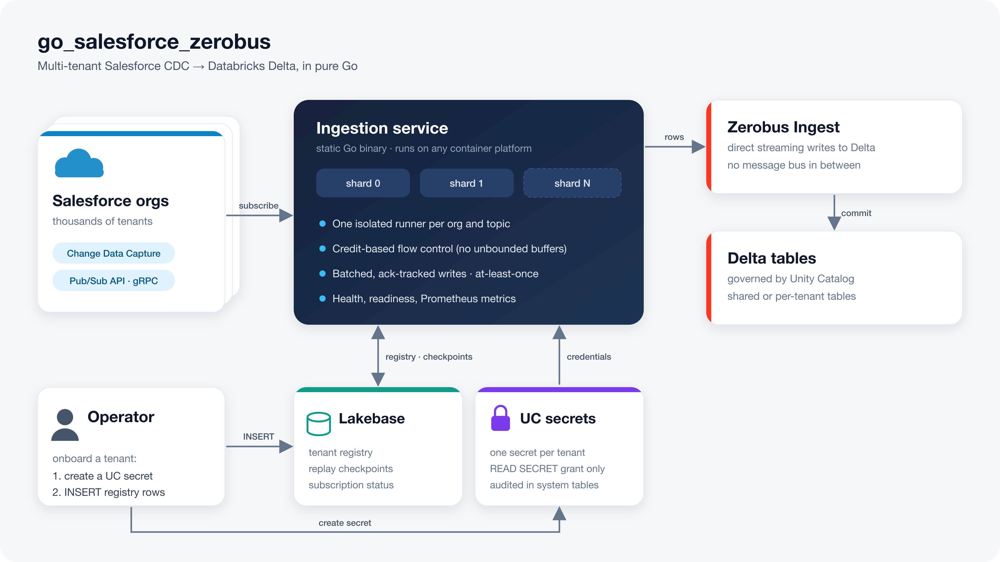

# go_salesforce_zerobus

Streams Salesforce Change Data Capture (CDC) events from **many Salesforce orgs** into Databricks Delta tables. Events arrive over the [Salesforce Pub/Sub API](https://developer.salesforce.com/docs/platform/pub-sub-api/overview) and are written through the pure-Go [Zerobus SDK](https://github.com/databricks/zerobus-sdk/tree/main/purego).



- **Pure Go, any container platform.** A static binary on a distroless image with no CGO and no native libraries. It runs on ECS, Azure Container Apps, Cloud Run, Kubernetes, or plain Docker.
- **Multi-tenant and horizontally scalable.** One deployment serves thousands of orgs. Run N containers, and each owns a hash shard of the tenants.
- **Onboarding is a row insert.** Tenants live in a [Lakebase](https://docs.databricks.com/aws/en/oltp/) Postgres registry that the service polls, so there is no redeploy.
- **Credentials in Unity Catalog secrets.** Each tenant's Salesforce credentials are a [UC secret](https://docs.databricks.com/aws/en/security/secrets/unity-catalog-secrets). Access is governed by UC grants and audited.
- **At-least-once and isolated.** A replay checkpoint advances only after Zerobus acknowledges the row. Every (org, topic) subscription has its own supervised runner, so one broken org never affects the others.

It replaces the single-tenant [`../go_salesforce_zerobus_cgo`](../go_salesforce_zerobus_cgo/DEPRECATED.md), and it can run that service's configuration unchanged (see [Migrating](#migrating-from-go_salesforce_zerobus_cgo-or-the-python-service)).

## Contents

- [Salesforce prerequisites](#salesforce-prerequisites)
- [Quick start](#quick-start)
- [Tenant credentials (Unity Catalog secrets)](#tenant-credentials-unity-catalog-secrets)
- [Runtime contract](#runtime-contract-any-container-platform)
- [Configuration](#configuration)
- [Delivery semantics](#delivery-semantics) · [Delta table](#delta-table) · [Operating](#operating)
- [Scaling and capacity](#scaling-and-capacity)
- [Migrating](#migrating-from-go_salesforce_zerobus_cgo-or-the-python-service) · [Development](#development) · [Troubleshooting](#troubleshooting)

## Salesforce prerequisites

In each Salesforce org:

| Requirement | Details |
|---|---|
| App for OAuth | A Connected App (or External Client App) with OAuth enabled, the `api` scope, **Enable Client Credentials Flow** turned on, and a **Run As** user set. Record its consumer key (the `client_id`) and consumer secret. |
| Integration user | The Run As user: API Enabled, with read access to each captured object and its fields. CDC omits fields the user can't see. |
| Change Data Capture | Setup → Change Data Capture → select the objects to stream. Editions include a limited number of objects without an add-on. |
| Network | If the org restricts login IP ranges, allow the service's egress IPs. |
| Limits | Pub/Sub event delivery allocations apply per org. Size high-volume orgs accordingly. |

Username/password (SOAP) login is also supported for legacy setups (`auth_type = 'soap'`), but client credentials is recommended.

## Quick start

### 1. Deploy the Databricks resources (bundle)

[`databricks.yml`](databricks.yml) declares:
- the Lakebase project (branch `production`, endpoint `primary`);
- a dedicated Unity Catalog schema for tenant secrets (default `<catalog>.salesforce_zerobus_secrets`).

The `prod` target protects both from `bundle destroy`.

```bash
make bundle-deploy PROFILE=<profile> SP=<service principal application ID> CATALOG=<catalog>   # TARGET=dev by default
make lakebase-env  PROFILE=<profile> SP=<service principal application ID> CATALOG=<catalog>   # prints SFZB_LAKEBASE_ENDPOINT
```

The postdeploy hook runs as you, the deployer:
1. `zerobus bootstrap lakebase` creates the service principal's Postgres role and grants it `CONNECT, CREATE` on the database.
2. `zerobus bootstrap uc-secrets` grants the service principal `USE SCHEMA` and `READ SECRET` on the secrets schema. Bundles can't declare secret grants themselves.

On first start, or with `zerobus migrate`, the service creates and owns its `sfzb` Postgres schema (registry, status, checkpoints). `make bootstrap` re-runs both grant steps.

### 2. Grant access to the target Delta tables

The bundle doesn't manage the CDC tables. On the target catalog and schema, the service principal needs:
- `USE CATALOG` on the catalog (this also covers the secrets schema);
- `USE SCHEMA` and `CREATE TABLE` on the schema, so the service can create and migrate tables. Alternatively, pre-create each table with the DDL from `zerobus ddl <catalog.schema.table>` and grant `SELECT, MODIFY` on it.
- `CAN USE` on a SQL warehouse, used for table DDL only.

### 3. Run the container

```bash
docker build -t salesforce-zerobus .
docker run --rm -p 9090:9090 \
  -e DATABRICKS_HOST=https://<workspace>.cloud.databricks.com \
  -e DATABRICKS_CLIENT_ID=<sp-app-id> -e DATABRICKS_CLIENT_SECRET=<sp-secret> \
  -e SFZB_ZEROBUS_ENDPOINT=https://<workspace-id>.zerobus.<region>.cloud.databricks.com \
  -e SFZB_LAKEBASE_ENDPOINT=projects/salesforce-zerobus/branches/production/endpoints/primary \
  -e SFZB_WAREHOUSE_ID=<warehouse-id> \
  -e SFZB_DEFAULT_TABLE=<catalog>.<schema>.cdc_events \
  salesforce-zerobus
```

Pass `DATABRICKS_CLIENT_SECRET` through your platform's secret mechanism (ECS task secrets, Container Apps secrets, Cloud Run secrets), not a plain environment value.

### 4. Onboard a tenant

1. **Store the credentials** as a UC secret; see [Tenant credentials](#tenant-credentials-unity-catalog-secrets).
2. **Insert the registry rows**, as in [`examples/onboard.sql`](examples/onboard.sql). Any Postgres client works; with the CLI: `databricks psql projects/<project>/branches/production/endpoints/primary --profile <p> -- -d databricks_postgres`.

```sql
INSERT INTO sfzb.tenants (tenant_key, org_id, instance_url, auth_type, client_id, client_secret_ref)
VALUES ('acme-prod', '00D5g000000AbCdEAA', 'https://acme.my.salesforce.com', 'oauth_client_credentials',
        '3MVG9...', 'uc-secret://main.salesforce_zerobus_secrets.acme_prod#client_secret');
INSERT INTO sfzb.subscriptions (tenant_key, topic) VALUES ('acme-prod', '/data/ChangeEvents');
```

- **Pickup:** the running service picks up changes within `SFZB_TENANTS_POLL_INTERVAL` (30s).
- **Defaults:** `NULL` columns take service defaults (`SFZB_DEFAULT_*`).
- **Invalid rows** are skipped and reported in `sfzb.subscription_status` as `invalid_config`; they never block other tenants.
- **Bulk or GitOps onboarding:** `zerobus tenants apply -f examples/tenants.yaml [-prune]`.
- **Registry access for your user:** create a role with `zerobus bootstrap lakebase -writer <you@example.com>`; the service grants it registry access through `SFZB_REGISTRY_WRITERS`.

**Tip:** subscribe each org to `/data/ChangeEvents`, the standard channel that covers every CDC-enabled object, rather than one topic per object. That keeps subscriptions, streams and Salesforce allocations at one per org.

## Tenant credentials (Unity Catalog secrets)

Tenant credentials are stored as Unity Catalog secrets and referenced from the registry with `uc-secret://<catalog>.<schema>.<secret>[#json-field]`. Only the reference is stored in Lakebase; the value lives in Unity Catalog.

- **One secret per tenant**, holding a small JSON object so a single secret can carry every credential the tenant needs:

  ```bash
  # acme_prod.json — create it with restrictive permissions and delete it afterwards
  # {"catalog_name": "main", "schema_name": "salesforce_zerobus_secrets", "name": "acme_prod",
  #  "value": "{\"client_secret\": \"<consumer secret>\"}", "comment": "Salesforce org acme-prod"}
  databricks secrets-uc create-secret --json @acme_prod.json --profile <p>
  ```

  Reference individual fields with `#client_secret`, `#password`, `#security_token`, and so on. Use underscores in secret names (`acme_prod`).
- **Access:**

  | Who | Needs |
  |---|---|
  | The service principal | `USE CATALOG`, `USE SCHEMA` and `READ SECRET` (granted by the bundle bootstrap) |
  | Onboarding operators | `CREATE SECRET` and `WRITE SECRET`: `zerobus bootstrap uc-secrets -schema <catalog.schema> -sp <sp> -writer <principal>` |

  Every read is recorded in `system.access.audit`.
- **Rotation:** `databricks secrets-uc update-secret`. The service picks up the new value within `SFZB_SECRETS_TTL` (15m), because values are cached per secret and reads are rate limited by `SFZB_SECRETS_RPS`.
- **Limits:** UC secrets default to **100 secrets per schema and 1,000 per metastore**.
  - These are **soft limits**: for thousands of tenants, ask your Databricks account team to raise them.
  - Until then, you can spread tenants across several secrets schemas (run `bootstrap uc-secrets` for each).
- **Other sources:** `env://VAR` and `file:///path` references also work, for credentials injected by the container platform (e.g. the Lakebase native password in `SFZB_LAKEBASE_PASSWORD_REF`).

## Runtime contract (any container platform)

| | |
|---|---|
| Image | `ENTRYPOINT ["/sfzb"]`, `CMD ["run"]`, non-root, distroless static |
| Config | environment variables ([Configuration](#configuration)); a `./.env` file is also read for local runs |
| Liveness | `GET :9090/healthz`, true while the supervisor loop is alive and never tied to one org. For exec probes: `/sfzb healthcheck`. |
| Readiness | `GET :9090/readyz`, true once tenants are loaded and every Zerobus stream slot has attempted its first open |
| Metrics | `GET :9090/metrics` (Prometheus); low-cardinality labels only |
| Debug | `GET :9090/debug/subscriptions?state=&tenant=&table=&limit=&offset=`, `GET :9090/debug/streams`, optional pprof |
| Shutdown | SIGTERM → stop fetching → drain and flush Zerobus → commit final checkpoints → mark subscriptions `stopped` → exit. Give it a ≥ 60s stop timeout (`SFZB_SHUTDOWN_TIMEOUT` is 45s). |
| Scale-out | N instances with `SFZB_SHARD_COUNT=N` and a distinct `SFZB_SHARD_INDEX` each (`auto` reads a trailing `-<n>` from the hostname). One single-instance service or app per shard. |
| Egress | `api.pubsub.salesforce.com:7443`, Salesforce instance URLs, the Zerobus endpoint, the workspace URL, Lakebase `:5432` |

During deploys, avoid running two instances of the same shard at once ("stop before start"). An overlap is safe but causes duplicate rows.

## Configuration

Flags override environment variables; `sfzb run -h` lists everything.

| Variable | Default | |
|---|---|---|
| `DATABRICKS_HOST`, `DATABRICKS_CLIENT_ID`, `DATABRICKS_CLIENT_SECRET` | — | Service principal for Zerobus, Unity Catalog (tables, secrets), SQL and Lakebase |
| `SFZB_ZEROBUS_ENDPOINT` | — | `https://<workspace-id>.zerobus.<region>.cloud.databricks.com` |
| `SFZB_TENANT_SOURCE` | `lakebase` | `lakebase` (registry tables), `file` (dev/test: `SFZB_TENANTS_FILE`), `env` (single tenant from `SALESFORCE_*`) |
| `SFZB_TENANTS_POLL_INTERVAL` | `30s` | Registry poll interval (reads one version counter) |
| `SFZB_DEFAULT_TABLE` | — | Target for subscriptions without `target_table` |
| `SFZB_DEFAULT_REPLAY`, `SFZB_DEFAULT_ON_REPLAY_EXPIRED` | `LATEST`, `EARLIEST` | Start position with no checkpoint; fallback when a stored replay ID has aged out |
| `SFZB_SHARD_INDEX`, `SFZB_SHARD_COUNT` | `0`, `1` | Jump-consistent-hash sharding on `tenant_key` (`tenants.shard_pin` overrides it) |
| `SFZB_LAKEBASE_ENDPOINT` | — | `projects/<p>/branches/<b>/endpoints/<e>`; OAuth passwords are minted and refreshed automatically |
| `SFZB_LAKEBASE_SCHEMA` | `sfzb` | Postgres schema for registry, status and checkpoints |
| `SFZB_LAKEBASE_PASSWORD_REF` + `SFZB_LAKEBASE_USER` | — | Native Postgres login instead of OAuth |
| `SFZB_REGISTRY_WRITERS` | — | Postgres roles to grant tenant-management access (create them with `bootstrap lakebase -writer`) |
| `SFZB_CHECKPOINT_STORE` | `lakebase` | `lakebase`; `delta` (derived from the event table, single-tenant mode); `memory` |
| `SFZB_CHECKPOINT_INTERVAL` | `5s` | Batched checkpoint commit interval |
| `SFZB_WAREHOUSE_ID` | — | SQL warehouse for Delta DDL (`SFZB_SCHEMA_MODE=migrate`) |
| `SFZB_SCHEMA_MODE` | `migrate` | `migrate` (create tables and add columns), `verify`, `off` |
| `SFZB_SECRETS_TTL`, `SFZB_SECRETS_RPS` | `15m`, `10` | UC secret cache lifetime and read rate |
| `SFZB_SF_SUBS_PER_CONN` | `100` | Subscribe streams per shared gRPC connection |
| `SFZB_ZB_STREAMS_PER_TABLE` | `auto` | Stream slots per table (`auto` = 1 per 250 subscriptions, max 16) |
| `SFZB_ZB_STREAMS_PER_SDK` | `50` | Zerobus streams per SDK connection |
| `SFZB_AUTH_RPS`, `SFZB_SUBSCRIBE_RPS`, `SFZB_SCHEMA_RPS` | `20, 20, 20` | Startup and thundering-herd protection (each org still sees one login) |
| `SFZB_ADMIN_ADDR`, `SFZB_ENABLE_PPROF` | `:9090`, `false` | |
| `SFZB_LOG_LEVEL`, `SFZB_LOG_FORMAT` | `info`, `json` | Per-event logs are `debug` only |

## Delivery semantics

- **At-least-once.** After a crash, up to one checkpoint interval of acked events is redelivered. A graceful shutdown redelivers nothing. Deduplicate downstream on `event_id`, or on `(org_id, replay_id)`.
- **Resume order:**
  1. the Lakebase checkpoint, used only if its `org_id` matches the org we authenticated as (which guards against sandbox refreshes);
  2. otherwise `replay_default`.
- **Quiet orgs** move their checkpoint forward on Salesforce keepalives, so their replay IDs don't age out.
- **Expired replay IDs** (Salesforce keeps about 72h of events) fall back to `on_replay_expired`, count in `sfzb_replay_fallback_total`, and are logged as errors.
- **Undecodable events** are still written: the raw `payload_binary` and `schema_json` are kept and `decode_error` is set.
- **Rows larger than 8MiB** drop `schema_json`, then `record_data_json`, then `payload_binary`, and record what was dropped in `decode_error`.

## Delta table

The table keeps the original 16 columns shared with the Python service and adds 7 nullable columns:

| Column | Source |
|---|---|
| `topic` | Pub/Sub topic |
| `tenant_key` | registry tenant key |
| `decode_error` | set when decoding failed or the row was truncated |
| `commit_number`, `sequence_number`, `transaction_key`, `commit_user` | `ChangeEventHeader` |

- **Migration:** `SFZB_SCHEMA_MODE=migrate` adds missing columns with `ALTER TABLE ... ADD COLUMNS` and never drops or retypes a column.
- **New tables** use `CLUSTER BY (org_id, entity_name)`.
- **`record_data_json`** is standard JSON (unions unwrapped), matching the Python service.
- **Routing:** by default all orgs share one table, keyed by `org_id`, `tenant_key` and `topic`. Set `subscriptions.target_table` to give an org, or one object, its own table.

**Downstream:** `lakeflow_declarative_pipeline.py` infers each object's Avro schema from the latest row across *all* orgs, which assumes one org per table. Before many orgs share a table, make that lookup `org_id`-aware, or route orgs to separate tables.

## Operating

- **What's failing right now?**

  ```sql
  SELECT tenant_key, topic, state, detail, restarts, last_ack_at, owner
  FROM sfzb.subscription_status WHERE state <> 'running' ORDER BY updated_at DESC;
  ```

- **States:**

  | State | Meaning | Retry |
  |---|---|---|
  | `pending` | startup staggering | — |
  | `running` | streaming | — |
  | `backoff` | transient, quota or Zerobus errors | backoff by error class |
  | `failed` | credentials rejected, topic or permission problems, `org_id` mismatch | every 15 min |
  | `invalid_config` | the registry row failed validation | fix the row |
  | `stopped` | clean shutdown | — |

- **Pause a tenant:** `UPDATE sfzb.tenants SET enabled = false WHERE tenant_key = '...'`, or `zerobus tenants disable <key>`.
- **CLI:**
  - `zerobus tenants list|enable|disable`
  - `zerobus checkpoint get|reset <tenant> <topic>`
  - `zerobus validate` checks config and registry rows
  - `zerobus migrate` creates the Lakebase tables and migrates Delta tables ahead of a deploy
  - `zerobus ddl <table>` prints `CREATE TABLE`
- **Key metrics** (all `sfzb_*`):
  - `subscriptions{state}`
  - `events_received_total`, `events_acked_total`
  - `event_e2e_seconds`
  - `zerobus_streams{state}`
  - `checkpoint_oldest_uncommitted_seconds`
  - `sf_rpc_errors_total{op,code}`
  - `replay_fallback_total`
  - `subscription_restarts_total{reason}`
- A summary line with the top failing subscriptions is logged every minute.

## Scaling and capacity

Each (org, topic) subscription runs in its own goroutines, with its own credit budget (`max_unacked`, default 500 events in flight). If Zerobus slows down, the service asks Salesforce for less instead of growing memory. Resources are shared across orgs where that's what makes scale possible:
- Salesforce gRPC connections: 100 streams per connection;
- Zerobus stream slots per table: 1 per 250 subscriptions;
- Lakebase writes: one batched checkpoint upsert per replica every 5s, whatever the event rate.

**Measured**

| Orgs (1 subscription each) | Events/s sustained | Ingested | All streaming after | Goroutines | Memory (incl. simulators) |
|---|---|---|---|---|---|
| 2,000 | 2,000 | 100% | 9s | ~12k | 232 MiB heap |
| 5,000 | 5,000 | 100% | 9s | ~30k | 617 MiB heap |
| 8,000 | ~7,970 | 100% | 7s | ~49k | 962 MiB heap, 1.48 GB RSS, ~1.3 CPU cores |

**How the test works:** `make load` runs [`cmd/sfzb-loadgen`](cmd/sfzb-loadgen).
- Inside one process it starts a fake Salesforce login server and a fake Pub/Sub gRPC server (real protocol: replay IDs, `num_requested` flow control, keepalives), with one simulated org per tenant.
- A producer emits real Avro-encoded CDC events into random orgs at the target rate.
- The service's own code runs unchanged against the simulators: auth, subscriptions, decoding, batching and ack tracking. Zerobus is replaced by an in-memory stand-in with 20ms ack latency, and checkpoints by an in-memory store.
- Results above are from an Apple M4 Pro laptop, with login and subscribe limits raised for the run.

This measures the service's own overhead. Real throughput also depends on Salesforce allocations and Zerobus and network latency, so run a staging soak before production.

**Suggested sizing**
- ≤ 2,000 subscriptions per replica, with 2 vCPU / 4 GiB and `GOMEMLIMIT=3GiB`. For example, 8,000 orgs → `SFZB_SHARD_COUNT=4`, or 8 for a smaller blast radius.
- Raise `SFZB_AUTH_RPS` and `SFZB_SUBSCRIBE_RPS` (e.g. to 50) to shorten cold starts; at the default 20/s, 2,000 orgs take about 100s to all come up.
- Route unusually large orgs to their own table (`target_table`) or shard (`shard_pin`).

## Migrating from `go_salesforce_zerobus_cgo` or the Python service

Point the new service at the same environment. When `SALESFORCE_CHANGE_EVENT_CHANNEL` is set and no other tenant source is configured, it runs a single tenant (`default`) built from these variables:
- `SALESFORCE_*` (OAuth client credentials, or SOAP with `SALESFORCE_TOKEN`);
- `DATABRICKS_WORKSPACE_URL`, `DATABRICKS_INGEST_ENDPOINT`, `DATABRICKS_SQL_ENDPOINT`, `DATABRICKS_ZEROBUS_TARGET_TABLE`;
- `DATABRICKS_CLIENT_ID` and `DATABRICKS_CLIENT_SECRET`.

Where it resumes from depends on whether Lakebase is configured:
- **Without Lakebase:** checkpoints are derived from the Delta table itself (the latest row), which is the same resume behavior as the old services.
- **With `SFZB_LAKEBASE_ENDPOINT`:** checkpoints go to Lakebase. The first start seeds from the old rows in the table (`SFZB_SEED_FROM_DELTA=true`).

To go multi-tenant, store the org's credentials as a UC secret, register it in `sfzb.tenants`, set `SFZB_TENANT_SOURCE=lakebase`, and drop the `SALESFORCE_*` variables.

## Development

```bash
make lint test-race        # unit, component and in-process e2e tests (fake Salesforce + in-memory Zerobus)
make test-pg               # registry and checkpoint SQL against a throwaway local Postgres
make build build-linux     # static binaries in ./bin
make load                  # capacity run (see "How the test works")
make demo                  # fake Salesforce for 20 orgs; prints the env to run ./bin/sfzb against it
make proto                 # regenerate protobuf code (protoc + pinned plugins in ./bin)
```

The architecture image is rendered from [`docs/architecture.svg`](docs/architecture.svg): `rsvg-convert -z 2 -o docs/architecture.png docs/architecture.svg`.

See [DESIGN.md](DESIGN.md) for the internals: flow control, checkpoint invariants, pooling and failure handling.

## Troubleshooting

| Symptom | Fix |
|---|---|
| Subscription `failed` with `grant READ SECRET on schema …` | Re-run `make bootstrap`, or `GRANT READ SECRET ON SCHEMA <catalog>.<schema> TO \`<sp>\``. The service principal also needs `USE CATALOG`. |
| Subscription `failed` with `unity catalog secret … not found` | Check the `client_secret_ref` name (three parts, underscores) and that the secret exists in that schema |
| Row shows `invalid_config` | Read its `detail` in `sfzb.subscription_status`; fix the row and the service reloads it within the poll interval |
| `bundle deploy` fails with `forced token refresh: cache update: exit status 45` | The Terraform provider's refresh of your CLI token failed. Deploy with the profile's current token: `DATABRICKS_HOST=https://<workspace> DATABRICKS_TOKEN=$(databricks auth token --profile <p> \| jq -r .access_token) DATABRICKS_CONFIG_FILE=/dev/null databricks bundle deploy -t dev --var service_principal_app_id=<sp> --var catalog=<catalog>` |
| CLI returns `Refresh token is invalid` | Sign in again: `databricks auth login --host https://<workspace> --profile <p>` |
| Zerobus stream stays `broken` with a permission error | The service principal needs `USE CATALOG`, `USE SCHEMA` and `SELECT, MODIFY` (or `CREATE TABLE`) on the target table's schema |
